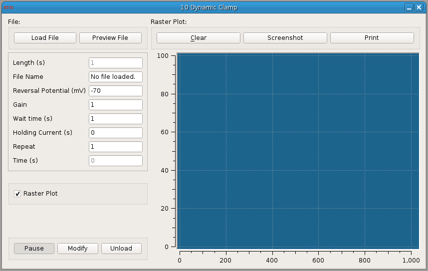

###Dynamic Clamp File

**Requirements:** None  
**Limitations:** None  

<!--start-->
This module applies a conductance waveform that has already been saved in ASCII format. It uses the current real-time period to determine the length of the trial, sampling one row from the ASCII file at each time step. If you use it with the SpikeDetect module, you can view a raster plot in real-time of spike times for each trial.
<!--end-->

####Input Channels
1. input(0) : Membrane Potential (mV)
2. input(1) : Spike State

####Output Channels
1. output(0) : Command

####Parameters
1. File Name : ASCII file containing conductance waveform with values in siemens
2. Reversal Potential (mV) : reversal pot. of artificial conductance
3. Gain : gain multiplied agains conductance
4. Wait time (s) : time between trials of applied artificial conductance
5. Holding Current : current to inject while waiting between trials
6. Repeat : number of trials to run

####States
1. Time (s) : time (s)
